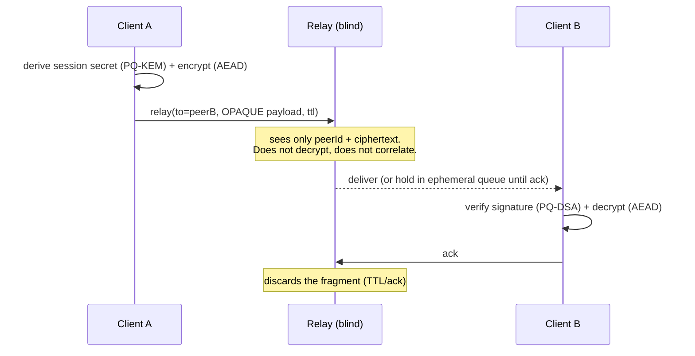

# mytho.chat — protocol

> **Status: v1.0 (Q2 2026).** This is the public specification of a deployed, operating service. The protocol numbering follows semantic versioning at the spec level: backward-compatible additions bump the minor (`v1.1`, `v1.2`); breaking changes bump the major (`v2.0`) and the `wire_version` byte together. An independent cryptographic audit is planned and not yet published — until it is, the security properties in §11 are claimed design targets, not certified guarantees.
>
> **Conformance.** The binary wire-format described in `docs/wire-format.md` §3–§7 (including `delivery_token`, `padding_bin` enforcement, `wire_version` validation, sealed-sender envelope) is the conformance target for v1.0 implementations. Where the spec uses MUST/MUST NOT, those are requirements a conforming v1.0 implementation must meet. A v1.0 implementation that does not satisfy them is non-conformant on that surface and SHOULD be documented as a deviation.
>
> **Academic specification / reference material.** This repository describes the **protocol** behind mytho.chat's post-quantum, end-to-end (E2E) messaging. It is conceptual documentation — **not** the production implementation, which is maintained privately to protect operational security and intellectual property. Nothing here contains secrets, keys, or infrastructure details. The specification is sufficient for academic review of the protocol design; a minimal reference implementation of the cryptographic core is anticipated for independent verification.

Licensed under **Apache License 2.0**.

---

## 0. Why this exists

Privacy has quietly become a luxury good.

In 2025, security researchers reported a single aggregated dataset of roughly **16 billion** login credentials — usernames, passwords, and session tokens compiled from years of breaches and infostealer malware: among the largest such compilations ever assembled. The same period brought major breaches of highly sensitive data — including healthcare records and even schoolchildren's information — while European regulators have levied **billions of euros** in GDPR fines that arrive *after* the data is already gone.

The pattern is structural, not accidental. Every message you send through a conventional platform is stored on a server you don't control. That stored message does not expire when the conversation ends. It waits. It can be subpoenaed in 2030, leaked in a breach in 2035, used in a workplace dispute in 2040, or fed to a model in 2045. When a central server holds your messages and your keys, it becomes a **single point of pressure** — and points of pressure eventually yield, whether to attackers, to courts, or to commercial incentive.

In August 2024, the founder of one of the world's largest messaging platforms — a platform that marketed privacy — was arrested. In the months that followed, that platform handed identifiers for **thousands of users** to authorities. Not out of malice. **Out of architecture.** The data existed, so it could be compelled.

Before the digital era, a conversation in a bar was just a conversation. A family argument was forgotten. A relationship that ended became a memory, not evidence. People were allowed to change, because the past did not follow them with perfect fidelity forever.

mytho.chat is an attempt to give that back — not as a policy promise that can be revoked, but as a **property of the system itself**. If the server never holds the keys, it cannot read the messages. If messages expire by default, there is nothing to compel after they're gone. The goal is not to *promise* privacy. It is to make the absence of surveillance a structural fact: the operator cannot betray what it never possessed.

This repository documents how.

---

## 1. Overview

mytho.chat is a **zero-touch message relay**: the server forwards **opaque** packets between participants and **never** has access to their content. All confidentiality and authenticity are established **at the endpoints** (the client). By construction, the server is a blind courier — it sees a destination identifier and an encrypted blob, nothing more.

The protocol is designed as a **reusable transport layer** for E2E-encrypted messaging in arbitrary applications. The identity issuer is intentionally external (see §9), allowing the same relay protocol to serve as the chat backbone for multiple consumer products with distinct user bases, without any of them sharing message content with the relay.

## 2. Design goals

- **Real E2E confidentiality** — the relay operator cannot read messages, not even under coercion (it does not hold the keys).
- **Post-quantum resistance** at the key-establishment layer.
- **Metadata minimization** — the relay keeps the bare minimum, for the minimum time (TTL-based ephemerality), and never correlates content.
- **Conservative composition** — only **standardized, audited** primitives, combined simply. **No home-grown cryptography.**
- **Fail-closed** — without valid credentials, nothing flows; the relay rejects.

## 3. Threat model

| Adversary | Mitigation |
| --- | --- |
| Relay operator (honest-but-curious or compromised) | Opaque E2E payload; the server never sees plaintext or keys |
| Network interceptor (MITM) | AEAD + post-quantum sender signature; signed session tokens |
| Adversary with a quantum computer ("harvest-now, decrypt-later") | Post-quantum KEM (ML-KEM) at key exchange |
| Future compromise of a long-term key | Forward secrecy + post-compromise security via ratchet |
| Abuse / spam / enumeration | Proof-of-Work on registration + per-IP rate limiting + fail-closed auth |
| Account ↔ chat-identity correlation by the relay | Identity binding held in a separate trust domain (issuer), never exposed to the relay (see §8) |
| Malicious / compromised issuer | Can forge session tokens and authorize delivery, but holds **no** message keys — E2E confidentiality and integrity survive. Account-level trust is delegated to the issuer **by design** (see §9). |
| Relay availability (DoS) | Connection/`RELAY` flooding and ephemeral-queue exhaustion are mitigated by per-IP rate limiting, recipient quotas, and registration Proof-of-Work; full availability under a resourced DoS adversary is a **partial non-goal**. |
| Downgrade / replay | Rejected — `wire_version` mismatch is fatal (`BAD_VERSION`), `delivery_token.nonce` is single-use, and message keys are erased after use. |

**Out of scope (non-goals):** compromise of an endpoint **device** (if the endpoint is hostile, E2E cannot help); network-level traffic analysis (packet **timing** and **volume** patterns — partial size mitigation only, see §7); recovery of already-expired ephemeral messages; correlation by an adversary who simultaneously compromises both the relay **and** the identity issuer.

## 4. Architecture — zero-touch relay



The relay exposes minimal operations: authenticate session, register peer, **relay** a fragment, fetch pending, **ack**. None of them involve plaintext.

## 5. Cryptographic suite (all public standards)

| Function | Primitive |
| --- | --- |
| Key Encapsulation (PQ) | **ML-KEM-768** (FIPS 203, NIST Security Category 3) |
| Signature (PQ) | **ML-DSA-65** (FIPS 204, NIST Security Category 3) |
| AEAD (symmetric encryption) | **XChaCha20-Poly1305** (draft-irtf-cfrg-xchacha-03) |
| Key derivation | **HKDF-SHA-256** (RFC 5869) with domain separation (see `docs/hkdf-labels.md`) |
| Forward secrecy / PCS | **Double Ratchet** (Perrin & Marlinspike, 2016) composed over the PQ primitives above |
| Session token | **ES256** (ECDSA P-256, RFC 7518; JWS RFC 7515) — verified, never issued by the relay |

**Construction note.** mytho.chat is **PQ-only** at the asymmetric layer: the key-exchange leg uses ML-KEM-768 *exclusively*, with no classical Diffie-Hellman component. This is a deliberate departure from PQXDH (Kret & Lyubashevsky, 2024) and X-Wing (Wood et al., 2024), which combine ML-KEM with X25519 for transitional defense-in-depth. The rationale is documented in §11a (Conformance & Construction Rationale): the project's primary threat is "harvest-now, decrypt-later" by a future quantum adversary; a hybrid leg adds operational complexity, larger handshake messages, and a second cryptanalytic surface to maintain, while providing protection only in the scenario where ML-KEM-768 is found to be broken classically *before* the adversary has captured the traffic — a scenario the project does not optimize for. Implementations targeting regulated-financial deployments (where defense-in-depth is required by policy) MAY swap in an X-Wing-style hybrid construction; such a deployment is **non-conformant** with this v1.0 spec and SHOULD be documented as a fork.

Reference libraries: the [`@noble`](https://paulmillr.com/noble/) family (audited). Normative references: NIST **FIPS 203/204**, **NIST SP 800-56C Rev. 2** (dual-input KDF), **RFC 5869** (HKDF), **`draft-irtf-cfrg-xchacha-03`** (XChaCha20-Poly1305), the **Double Ratchet** algorithm ([Perrin & Marlinspike, 2016](https://signal.org/docs/specifications/doubleratchet/)).

## 6. Session establishment (handshake)

1. Each peer publishes public **KEM** keys (ML-KEM) and **signature** keys (ML-DSA).
2. The sender **encapsulates** a secret against the recipient's public KEM key.
3. The secret is run through **HKDF** (with domain separation) → encryption keys.
4. The message is encrypted with **XChaCha20-Poly1305** and **signed** with ML-DSA.
5. Long-lived sessions advance via a **post-quantum double ratchet** (forward secrecy + post-compromise security).

The relay **takes part in none** of the steps above — it only transports the result.

## 7. Message model

- A message becomes one or more **opaque fragments** (supports large payloads, e.g. media, without the relay inspecting anything).
- Fragments use **deterministic size padding** (power-of-two bins) to mitigate trivial size-based traffic analysis. This does **not** prevent timing- or volume-based analysis (see §3 — out of scope).
- Each fragment has a **TTL**: the relay keeps it only until delivery/ack or until it expires (**ephemeral by default**, with no plaintext archive).
- Asynchronous delivery: recipient offline → ephemeral queue → delivery on reconnect → **ack** → discard.

## 8. Identity & privacy

- **Peer IDs** are public, opaque identifiers for a participant on the relay. A peerId is derived from a public signature key and need not reveal the underlying account or user.
- **Persona ↔ account unlinkability** — the binding between a public chat identity (peerId) and the issuer's account identifier is held in a **separate trust domain** (the identity issuer, §9) and is **never available to the relay**. The relay sees only the public peerId and the encrypted payload. A fully compromised relay operator cannot link peerIds to underlying accounts without independently compromising the issuer's protected data.
- **Sealed-sender scope** — the relay does learn the peerId of the **authenticated session** that connects (via the `AUTH`/ES256 token); what sealed-sender removes is the `sender_peer_id` from the **routing envelope and from persistence**, not from the active session. The anti-correlation guarantee is therefore operational: per §11a the relay **MUST NOT** persist any `sender_peer_id` ↔ `recipient_peer_id` mapping after a fragment is acked or expires, so no durable record links the sending session to the recipient.
- **Multiple personas** — a single user may hold several independent peerIds (distinct key pairs). To the relay these are unrelated participants; correlation between them is not possible at the relay layer.
- **Anti-abuse** — identity registration requires **Proof-of-Work** (a computational cost per creation) and **per-IP rate limiting**, mitigating spam and enumeration. Where a deployment must satisfy regulatory identification (e.g. financial use cases), account-level identity is enforced by the **issuer**, not the relay — preserving the relay's content- and correlation-blindness.

## 9. Authentication

Sessions are authorized by **signed tokens (ES256)** issued by a **central identity issuer** (outside the scope of this protocol). The relay is a **pure verifier**: it checks the signature against the issuer's public key and is **fail-closed** — without a valid key/signature, connection and relay are rejected. The relay **never** issues tokens and never holds private keys.

This separation is deliberate. Different deployments may run different issuers (a financial product may require strong account identity; an anonymous deployment may issue tokens against nothing but a Proof-of-Work). The relay protocol is identical in both cases, because the relay never learns what the issuer knows.

## 10. Moderation while preserving E2E

Because the relay does not read content, moderation operates over **metadata and reports**, never plaintext:

- A participant can **report** a peer.
- The operator acts on the peer's **identifier/state** (e.g. rate-limit, suspend) **without** access to message text.
- Deployments requiring stronger accountability bind enforcement at the **issuer** layer (account suspension), which is independent of the relay.

E2E confidentiality and moderation coexist. The relay does not need to read messages to act on abuse signals raised by participants.

## 11. Security properties (targeted)

The following are **claimed**, assuming: (a) correct client implementation; (b) the underlying cryptographic assumptions hold (ML-KEM and ML-DSA as currently believed by the cryptographic community); and (c) endpoint devices are not compromised. Any deviation invalidates the corresponding property.

- **End-to-end** confidentiality and integrity (the relay reads nothing).
- **Forward secrecy** and **post-compromise security** (ratchet).
- **Quantum resistance** at key exchange (PQ-KEM) — against "harvest-now, decrypt-later".
- **Sender authentication** via PQ signature (anti-MITM).
- **Fail-closed** session authentication.

These are design targets of the protocol, not certified guarantees of any particular deployment. See §16 regarding independent review.

## 11a. Conformance & Construction Rationale

This section pins **normative requirements** for conforming implementations and explains the construction choices above.

### Conformance keywords

MUST / MUST NOT / SHOULD / MAY follow [RFC 2119](https://www.rfc-editor.org/rfc/rfc2119) sense.

### Server (relay) MUST

- **MUST NOT** decrypt, parse beyond the routing envelope (`docs/wire-format.md` §3), log, or persist the `sealed_payload`.
- **MUST NOT** persist any mapping that links `sender_peer_id` ↔ `recipient_peer_id` after the fragment is acknowledged or expires.
- **MUST** verify ES256 session tokens against the issuer's public key (`fail-closed`); on signature/expiry/algorithm-confusion failure the relay **MUST** reject the connection.
- **MUST** validate `wire_version`; an unknown version **MUST** be rejected with `BAD_VERSION` (fatal).
- **MUST** validate `padding_bin` membership; rejection on out-of-set value (`BAD_PADDING_BIN`).
- **MUST** clamp `ttl_seconds` to the deployment hard limit (RECOMMENDED 604800s = 7 days; MUST NOT exceed 30 days).
- **MUST** enforce single-use of `delivery_token.nonce` for the lifetime of the token (`exp`).
- **MUST** rate-limit per-IP and per-peer; rate-limit storage failures **MUST** fail-closed (reject), not fail-open.

### Client MUST

- **MUST** verify ML-DSA-65 signatures on prekey bundles and (in non-deniable mode) on messages **before** AEAD decryption.
- **MUST** enforce the bounded skipped-key store (`MAX_SKIP`, see `docs/wire-format.md` §2); on overflow the receiver **MUST** drop the late message.
- **MUST** zeroize message keys, chain keys, and the master key after use.
- **MUST** use a cryptographically secure RNG for KEM randomness, AEAD nonces, and PoW.

### Construction rationale

- **PQ-only KEM (§5).** No classical leg. Rationale documented above (§5 construction note).
- **Deterministic AEAD nonce (`docs/wire-format.md` §5).** Derived by HKDF (RFC 5869, Extract-then-Expand, empty salt) from the per-message key (`MK`) — eliminates the nonce-reuse class of bugs without consuming wire bandwidth.
- **Sealed-sender (`docs/wire-format.md` §4).** Sender identity is NEVER on the routing envelope; the relay knows "some authenticated peer is delivering to R" via the HMAC token, but cannot link it to a specific `sender_peer_id` from the wire alone.
- **Single-use delivery tokens.** Bind to (sender, recipient, nonce, exp); single-use enforced by SETNX-style `seen` set in the relay's ephemeral store.
- **Deniable mode (§10).** `deniable=1` omits the ML-DSA signature; authenticity rests on the AEAD shared key, known only to the two endpoints. **Neither the relay nor any external party can forge a deniable message** — but the recipient cannot prove to a third party that the sender wrote it.

## 12. What's in this repository

This repository is a **conceptual specification**, not the production codebase. The production relay and client implementations are maintained privately to protect operational security and intellectual property.

The specification here is sufficient for academic review of the protocol **design**. A future minimal reference implementation is anticipated for independent verification of the cryptographic core (see §13). The full product (clients, server infrastructure, deployment) is not distributed.

## 13. Roadmap (for this repository)

v1.0 ships the specification, the post-quantum double-ratchet state machine, the canonical HKDF-label table, and seven KAT vector files. Items already shipped and planned for v1.x:

- [x] Detailed fragment wire-format specification — [`docs/wire-format.md`](./docs/wire-format.md).
- [x] Post-quantum double-ratchet state machine (with diagrams) — [`docs/ratchet-state-machine.md`](./docs/ratchet-state-machine.md).
- [x] Canonical HKDF info-label table — [`docs/hkdf-labels.md`](./docs/hkdf-labels.md).
- [x] Known-Answer Test (KAT) vectors — `vectors/*.json` (generator at `scripts/generate-kat.mjs`).
- [ ] Minimal reference client implementation (independent verification of the cryptographic core).
- [ ] Independent third-party cryptographic audit (results to be published at `mytho.chat/transparency`).

These items are aspirational and carry no committed delivery date. This section will be updated as material is published; absence of an item indicates it has not yet been written, not that it is hidden.

## 14. References

- **NIST FIPS 203** — ML-KEM (Aug 2024). https://csrc.nist.gov/pubs/fips/203/final
- **NIST FIPS 204** — ML-DSA (Aug 2024). https://csrc.nist.gov/pubs/fips/204/final
- **NIST SP 800-56C Rev. 2** — dual-input KDF (Aug 2020).
- **RFC 5869** — HKDF.
- **`draft-irtf-cfrg-xchacha-03`** — XChaCha20-Poly1305 (IETF Internet-Draft, 2020).
- **RFC 7515 / RFC 7518** — JSON Web Signature / ES256.
- **The Double Ratchet Algorithm** — Perrin & Marlinspike, 2016. https://signal.org/docs/specifications/doubleratchet/
- **PQXDH** — Kret & Lyubashevsky, 2024. https://signal.org/docs/specifications/pqxdh/
- **X-Wing** — Wood et al., 2024. https://datatracker.ietf.org/doc/draft-connolly-cfrg-xwing-kem/
- **noble-post-quantum / noble-ciphers / noble-hashes** — https://paulmillr.com/noble/

## 15. License

Licensed under the **Apache License, Version 2.0** — see [`LICENSE`](./LICENSE).

```
Copyright 2026 The Mytho Project

Licensed under the Apache License, Version 2.0 (the "License");
you may not use this file except in compliance with the License.
You may obtain a copy of the License at

    http://www.apache.org/licenses/LICENSE-2.0

Unless required by applicable law or agreed to in writing, software
distributed under the License is distributed on an "AS IS" BASIS,
WITHOUT WARRANTIES OR CONDITIONS OF ANY KIND, either express or implied.
See the License for the specific language governing permissions and
limitations under the License.
```

## 16. Independent review

This specification is intended for academic and security-research scrutiny. We welcome:

- **Issues** opened against this repository describing protocol-level concerns.
- **Coordinated disclosure** of any cryptographic or design weakness via `security@mytho.chat`.
- **Public discussion** of the design tradeoffs documented in §3 and §11.

A formal third-party audit of the production cryptographic core is **planned and not yet completed** at the time of writing. No audit, certification, or formal verification should be assumed until explicitly published here and at `mytho.chat/transparency`.

## 17. Legal & operational

mytho.chat is, at this layer, a **protocol specification**. Production deployments are operated by individual entities subject to their respective jurisdictions and are responsible for their own legal compliance (e.g. GDPR, LGPD, and applicable communications law).

The reference deployment intends to maintain the following operational commitments, published when the deployment goes live:

- A **warrant canary** at `mytho.chat/canary`, updated periodically.
- A **transparency page** at `mytho.chat/transparency` summarizing any reviews, audits, and aggregate request statistics.
- A **security contact** at `security@mytho.chat` for coordinated disclosure.

These commitments describe intent for the reference deployment and do not bind third-party deployments of the protocol.

---

*"We are not asking you to trust us. We are removing the need to."*
