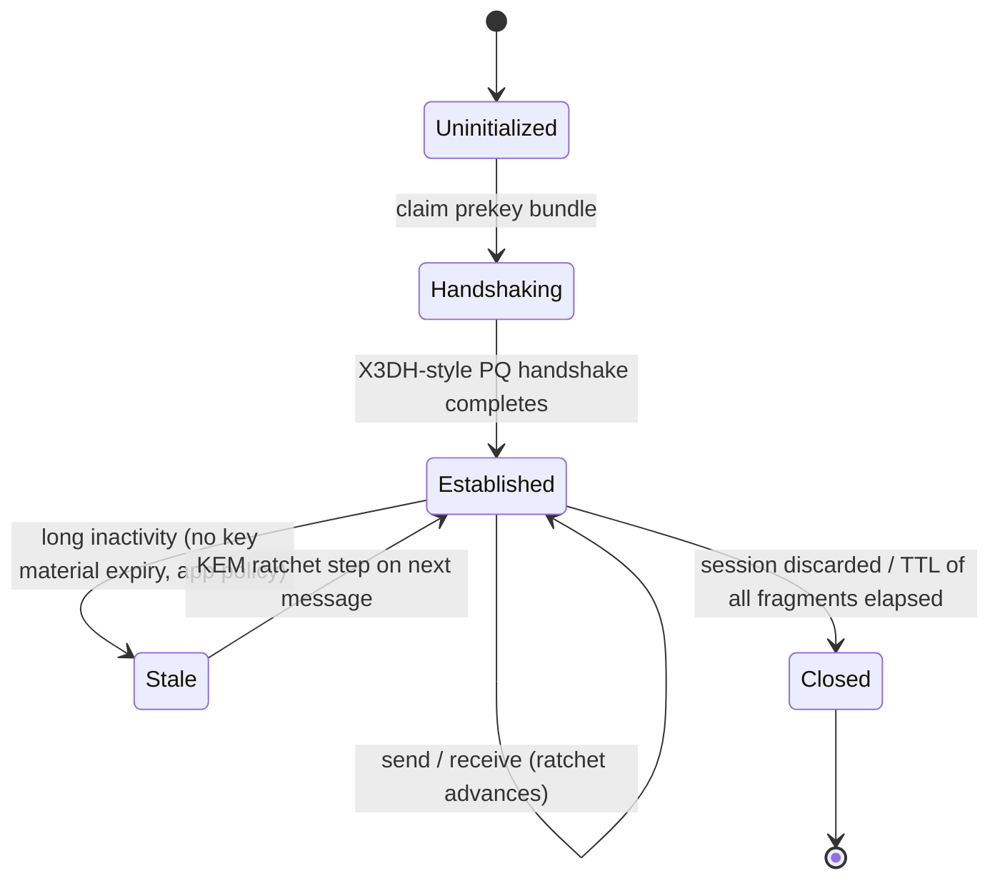
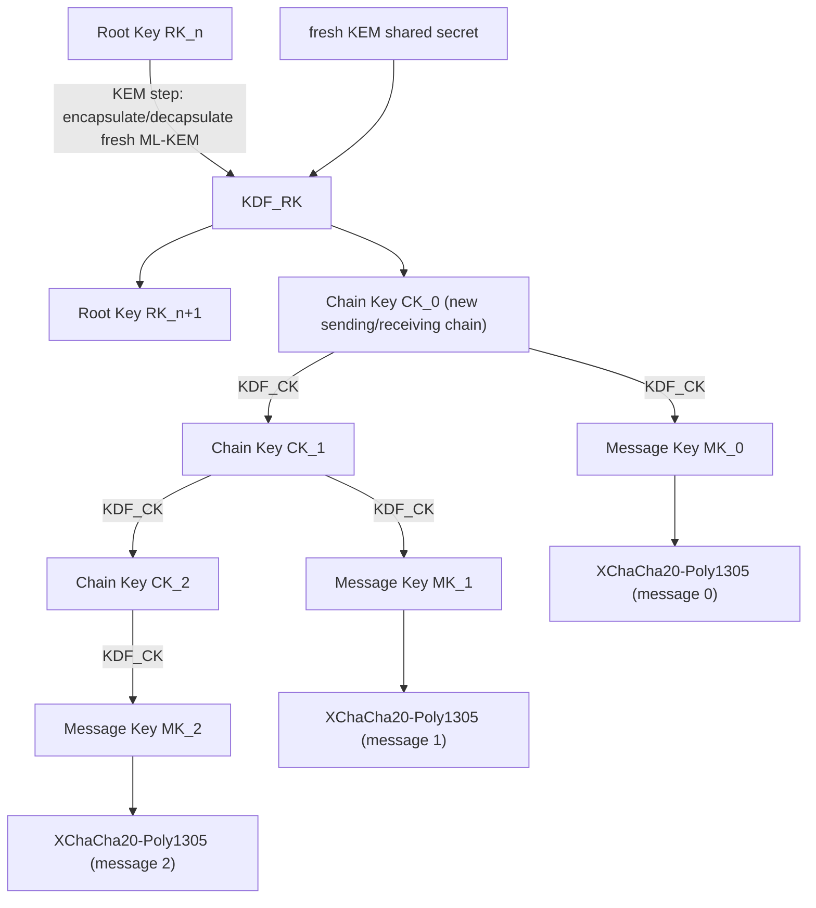
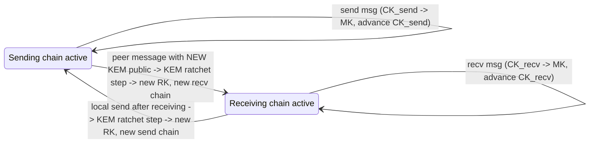
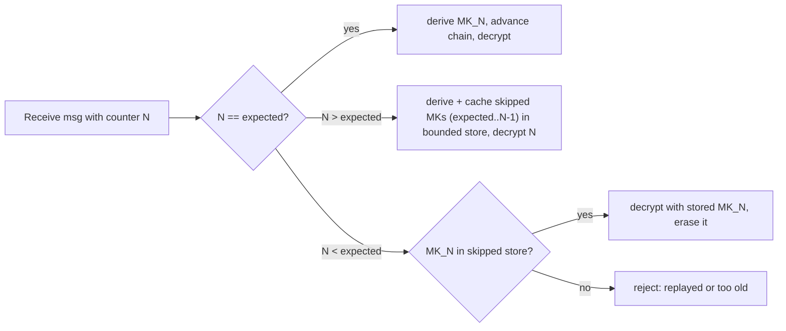

# Post-Quantum Double Ratchet — State Machine

> Part of the mytho.chat protocol specification (Draft v0.2). Companion to [`README.md`](../README.md) §6 (handshake) and §11 (security properties). This document describes the **session ratchet** used for long-lived conversations: how keys advance, when they are derived, and which security properties each transition provides.
>
> **Scope:** protocol-level state machine and key-derivation graph. This is **not** an implementation; constant-time concerns, memory zeroization, and side-channel hardening are implementation responsibilities (see [`SECURITY.md`](../SECURITY.md)).

---

## 1. What problem the ratchet solves

A single static key pair gives end-to-end encryption, but it is fragile in time:

- If the long-term key leaks **once**, every message ever captured is decryptable (no **forward secrecy**).
- After a compromise, the attacker can read everything **going forward** too (no **post-compromise security / PCS**).

The Double Ratchet (Perrin & Marlinspike) solves both by deriving a **fresh key for every message** and continuously folding in **new key-exchange material**. mytho.chat uses a **post-quantum** variant: the asymmetric ratchet step runs over a **post-quantum KEM (ML-KEM-768)** rather than a classical Diffie-Hellman, while retaining the same chain structure. There is **no classical (DH) leg**; see `README.md` §5 (Construction note) for the PQ-only rationale.

Two interacting ratchets:

1. **Symmetric-key ratchet** — a KDF chain advanced once per message. Provides forward secrecy *within* a chain.
2. **KEM ratchet ("DH ratchet" in classical terms)** — replaces the chain key material whenever the conversation changes direction, using a fresh ML-KEM encapsulation. Provides post-compromise security *across* chains.

---

## 2. Session lifecycle (top-level states)



- **Uninitialized** — no shared state. The initiator must fetch the peer's prekey bundle.
- **Handshaking** — the initial shared secret is being established (see §3).
- **Established** — normal operation; every message advances at least the symmetric ratchet.
- **Stale** — the application considers the session idle. No cryptographic expiry is imposed by the protocol; the next message simply performs a KEM ratchet step (the standard direction-change path).
- **Closed** — all session state is dropped. Because messages are ephemeral by default, a closed session leaves no plaintext archive.

---

## 3. Initial handshake (PQ X3DH-style)

The first shared secret is established from a prekey bundle, analogous to X3DH but built on ML-KEM encapsulation and ML-DSA signatures rather than classical DH.

```mermaid
sequenceDiagram
    participant I as Initiator
    participant Relay as Relay (blind)
    participant R as Responder (prekeys published)

    R->>Relay: publish bundle { IK_sig (ML-DSA), SPK (ML-KEM, signed), OTPK[] (ML-KEM) }
    I->>Relay: claim bundle for peerR
    Relay-->>I: { IK_sig, SPK, one OTPK (consumed) }
    Note over I: verify SPK signature with IK_sig (ML-DSA)
    I->>I: encapsulate against SPK  -> (ct_spk, ss_spk)
    I->>I: encapsulate against OTPK -> (ct_otpk, ss_otpk)
    I->>I: SK = HKDF(ss_spk || ss_otpk, info="mytho/handshake/v1")
    I->>I: initialize root key RK <- SK
    I->>Relay: relay( header{ct_spk, ct_otpk, IK_pub}, AEAD(msg, MK_0) )
    Relay-->>R: deliver (opaque)
    Note over R: decapsulate ct_spk, ct_otpk -> same SK -> same RK
    R->>R: verify initiator signature (ML-DSA) ; derive MK_0 ; decrypt
```

Key points:

- **Two encapsulations** (signed prekey + one-time prekey) are combined so that compromise of the long-lived signed prekey alone does not expose past sessions that also used a one-time prekey. The dual-input KDF construction follows [NIST SP 800-56C Rev. 2 §5.6.2.3](https://csrc.nist.gov/pubs/sp/800/56/c/r2/final).
- The **one-time prekey is consumed** at claim (the relay performs an atomic pop). If the pool is exhausted, the handshake proceeds with the signed prekey only (degraded forward secrecy for that first message) — and the initiator MUST set `ratchet_flags.bit1 = 0` (`handshake_otpk_used = false`) per `docs/wire-format.md` §5.4. The degradation is **explicit on wire**, not silent.
- The relay **verifies nothing cryptographic about the payload** — it only routes. Signature verification happens on the responder.

**Comparison with PQXDH.** This construction is structurally analogous to [PQXDH (Kret & Lyubashevsky, 2024)](https://signal.org/docs/specifications/pqxdh/) used by Signal, **with the classical X25519 leg removed**. See `README.md` §5 (Construction note) for the PQ-only rationale.

---

## 4. The two ratchets (key derivation graph)



- **KDF_RK** and **KDF_CK** are domain-separated HKDF-SHA-256 invocations (distinct `info` labels — `mytho/rk/v1`, `mytho/ck/v1`).
- A **Message Key (MK)** is used exactly once, then discarded. AEAD = XChaCha20-Poly1305.
- A **Chain Key (CK)** advances forward only; given CK_n you cannot recover CK_{n-1} (one-way KDF) → **forward secrecy** within a chain.
- A **Root Key (RK)** advances on every direction change, absorbing fresh ML-KEM material → **post-compromise security** across chains.

All HKDF `info` labels used by the ratchet (`mytho/rk/v1`, `mytho/ck/v1`, `mytho/handshake/v1`, `mytho/nonce/v1`) are listed in [`docs/hkdf-labels.md`](./hkdf-labels.md), which is the **canonical normative reference** for domain separation.

---

## 5. Sending and receiving transitions



A **direction change** (you were receiving, now you send; or vice versa) triggers a **KEM ratchet step**: a fresh ML-KEM keypair/encapsulation produces new shared material, the Root Key advances, and a brand-new chain begins. This is what heals the session after a potential compromise (PCS).

---

## 6. Out-of-order and skipped messages

Networks reorder and drop. The ratchet tolerates this without breaking forward secrecy:



- Skipped message keys are **pre-derived and cached** so a late-arriving message still decrypts.
- The skipped-key store is **bounded** by `MAX_SKIP = 2000` (see `docs/wire-format.md` §2). Exceeding it rejects rather than allocating unboundedly (DoS guard). Receivers MAY enforce a larger value.
- A message key, once used, is **erased** — replays of an already-consumed key are rejected (anti-replay; complements the relay-level `seen` guard described in the wire-format spec).

---

## 7. Security properties contributed by each mechanism

| Mechanism | Property |
| --- | --- |
| One-way Chain Key KDF | Forward secrecy within a chain |
| KEM ratchet on direction change (ML-KEM-768) | Post-compromise security; quantum-resistant key exchange |
| One-time prekeys at handshake | Forward secrecy for the very first message |
| ML-DSA signature on prekeys & messages | Sender authentication, MITM resistance |
| Single-use message keys + bounded skipped store | Replay resistance, bounded memory |
| HKDF domain separation | No cross-context key reuse |

**Deniability (formal note).** In `deniable = 1` mode, the ML-DSA-65 signature is omitted; authenticity rests on the AEAD shared key (`MK`) known only to the two endpoints. Consequence: the **relay** cannot forge a deniable message (it does not hold `MK`), and **no third party** can prove which of the two endpoints authored a given message. Only the recipient is convinced — and only because they know they didn't send it themselves.

All properties hold under the assumptions stated in [`README.md`](../README.md) §11 (correct client, sound primitives, uncompromised endpoint).

---

## 8. What this document does not cover

- **Wire byte layout** of headers and fragments → see `docs/wire-format.md`.
- **Group / multi-party** ratcheting (the above is the pairwise session). Group semantics are layered above pairwise sessions and are out of scope for v0.1.
- **Implementation hardening** (constant-time, zeroization, RNG sourcing) → see [`SECURITY.md`](../SECURITY.md).
- **Known-Answer Test vectors** → planned (roadmap item).

---

*Draft v0.2 — subject to change before a stable v1.0 marking. Feedback via `security@mytho.chat` or repository issues.*
